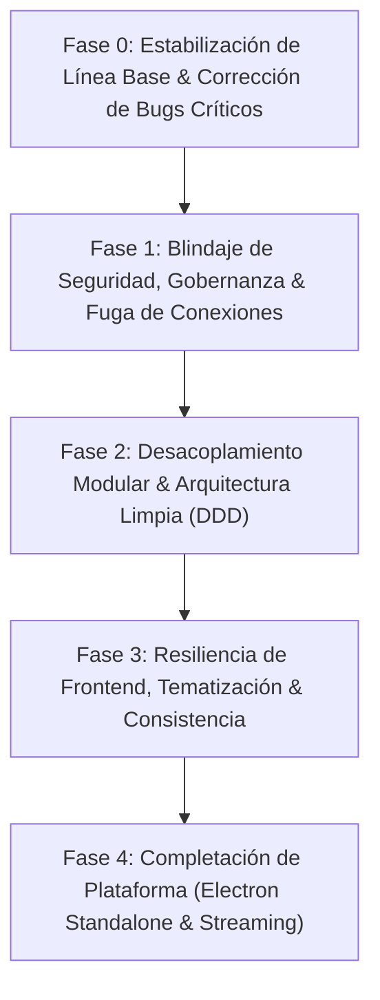

# 🌌 Auditoría Integral y Plan Estratégico de Mejora: Proyecto Dat.ia

**Fecha:** 25 de Septiembre de 2026  
**Rama:** `Avances-Felipe` (Commit: `c5f1af4`)  
**Alcance:** Backend (FastAPI, SQLAlchemy, sqlglot, PostgreSQL/SQLite) + Frontend (React 18, Vite, TypeScript, ECharts) + Scripts e Infraestructura.  
**Estado de Verificación Base:**  
- **Frontend Typecheck (`npx tsc --noEmit`):** ✅ 0 errores de compilación TypeScript.
- **Backend Test Suite (`py -m pytest`):** ⚠️ 103 aprobados, 1 fallido (`test_prompt2_remediation_answers_original_question`), 253 warnings de obsolescencia (`datetime.utcnow()`, `@app.on_event`).

---

## 1. Resumen Ejecutivo de la Auditoría

El proyecto **Dat.ia** presenta una base funcional y conceptual de alto valor en analítica conversacional con IA local offline, control de acceso por roles (RBAC) y validación de árboles de sintaxis abstracta (AST Guardrail). Ha alcanzado hitos significativos en visualización adaptativa (Apache ECharts) y soporte dual SQLite / PostgreSQL.

Sin embargo, la auditoría profunda identificó **fallas latentes que comprometen la estabilidad en producción**, incluyendo:
1. **Un error crítico de desempaquetado de tuplas (Unpack Crash)** que causa excepciones no controladas cuando una consulta devuelve cero registros.
2. **Mutación destructiva de datos (`DELETE`/`UPDATE`) en la base corporativa** durante la remediación interactiva de nulos, contradiciendo el principio de solo lectura estricta.
3. **Fuga silenciosa de conexiones y pools de SQLAlchemy** en cada consulta relacional contra PostgreSQL.
4. **Patrón antipatrón de datos ficticios en frontend (Mock Fallback)** que enmascara fallos de red y genera desincronización de estado con identificadores temporales aleatorios (`Date.now()`).
5. **Ausencia total del empaquetado standalone de escritorio (Electron 33)** documentado como pilar del proyecto.

A continuación se detallan exhaustivamente todos los hallazgos clasificados en las 7 dimensiones solicitadas.

---

## 2. Catálogo Crítico de Hallazgos

### Dimensión 1: Errores y Problemas de Funcionamiento (Bugs & Correctness)

#### H-01: Caída por Desempaquetado de Tupla en Consultas sin Resultados (`ValueError: too many values to unpack`)
- **Evidencia concreta:** [`backend/app/modules/chat_engine/kpi_calculator.py#L46-L60`](file:///c:/Users/Felipe/Desktop/Proyectos/democratizacion%20de%20datos/backend/app/modules/chat_engine/kpi_calculator.py#L46-L60) y [`backend/app/modules/chat_engine/engine.py#L675`](file:///c:/Users/Felipe/Desktop/Proyectos/democratizacion%20de%20datos/backend/app/modules/chat_engine/engine.py#L675).
- **Problema:** En `kpi_calculator.py`, cuando `rows` o `columns` está vacío (`if not rows or not columns:` en línea 47), el retorno es una tupla de **6 elementos**:
  ```python
  return kpis, "bar", chart_option, summary, exec_rep, []
  ```
  Sin embargo, en el resto de la función (líneas 132 y 242) se retornan **5 elementos**: `(kpis, chart_type, chart_option, summary, exec_rep)`. En `engine.py:675`, el llamador desempaqueta exactamente 5 variables:
  ```python
  kpis, chart_type, chart_option, fallback_summary, fallback_exec_report = KPICalculator.build_dynamic_visualization(...)
  ```
- **Consecuencias:** Cualquier consulta analítica legítima que no encuentre coincidencias (0 filas) o aplique un filtro estricto provoca una excepción interna no capturada `ValueError: too many values to unpack (expected 5, got 6)`, resultando en un error 500 para el usuario final.
- **Solución propuesta:** Estandarizar la firma de retorno de `build_dynamic_visualization` a 5 elementos en todos los caminos de ejecución, eliminando la lista vacía final sobrante en la línea 59 y ajustando la anotación de tipos a `Tuple[List[KPICard], str, Dict[str, Any], str, Optional[ExecutiveReport]]`.
- **Impacto:** ALTO | **Esfuerzo:** S | **Riesgo:** BAJO.
- **Dependencias:** Ninguna (corrección directa).

---

#### H-02: Referencia a Variable Indefinida `logger` en Manejador de Excepciones de Remediación
- **Evidencia concreta:** [`backend/app/modules/chat_engine/engine.py#L401`](file:///c:/Users/Felipe/Desktop/Proyectos/democratizacion%20de%20datos/backend/app/modules/chat_engine/engine.py#L401).
- **Problema:** En el bloque `try...except` de remediación de nulos en `engine.py`:
  ```python
  except Exception as ex:
      logger.warning(f"Error applying null remediation to DB: {ex}")
  ```
  El identificador `logger` no está importado ni inicializado en ninguna parte del módulo `engine.py`.
- **Consecuencias:** Si `NullManagerService.apply_null_policy` lanza cualquier excepción durante la ejecución de una consulta, el bloque `except` falla inmediatamente con `NameError: name 'logger' is not defined`, abortando el procesamiento y ocultando la causa raíz del error original.
- **Solución propuesta:** Importar `from app.core.logging import logger` en el encabezado de `engine.py`.
- **Impacto:** MEDIO | **Esfuerzo:** S | **Riesgo:** BAJO.
- **Dependencias:** Ninguna.

---

#### H-03: Falla en Caso de Prueba `test_prompt2_remediation_answers_original_question` por Pérdida de Banner Conversacional
- **Evidencia concreta:** [`backend/app/modules/chat_engine/engine.py#L720-L725`](file:///c:/Users/Felipe/Desktop/Proyectos/democratizacion%20de%20datos/backend/app/modules/chat_engine/engine.py#L720-L725) y [`backend/tests/test_null_policy_and_visualizations.py#L280`](file:///c:/Users/Felipe/Desktop/Proyectos/democratizacion%20de%20datos/backend/tests/test_null_policy_and_visualizations.py#L280).
- **Problema:** En entornos de prueba o cuando el LLM local está desconectado, `IntentClassifier.generate_conversational_response` devuelve `None`. En `engine.py`, la inyección del banner de remediación condiciona:
  ```python
  if conversational:
      conversational = banner + conversational
  ```
  Al ser `conversational` nulo, el banner nunca se concatena y `conversational` permanece como `None`. Posteriormente, `ResponseBuilder.build_analytics_response` fija `conversational_response = None`, provocando un fallo en la prueba:
  ```
  TypeError: argument of type 'NoneType' is not a container or iterable
  assert "Tratamiento de nulos" in response.conversational_response
  ```
- **Consecuencias:** La suite de pruebas de integración no pasa en limpio (`pytest` sale con código 1), y los usuarios sin LLM activo pierden la confirmación visual de que sus datos fueron depurados.
- **Solución propuesta:** Modificar la lógica para que, si `conversational` es `None` o vacío, se asigne directamente `conversational = banner + (fallback_summary or "")`.
- **Impacto:** ALTO | **Esfuerzo:** S | **Riesgo:** BAJO.
- **Dependencias:** H-02.

---

#### H-04: Sustitución Silenciosa de Consultas Fallidas por Tablas Aleatorias en Modo Emergencia
- **Evidencia concreta:** [`backend/app/modules/chat_engine/sql_executor.py#L187-L200`](file:///c:/Users/Felipe/Desktop/Proyectos/democratizacion%20de%20datos/backend/app/modules/chat_engine/sql_executor.py#L187-L200).
- **Problema:** Si la generación de SQL falla y la auto-corrección (`self-healing`) tampoco prospera, el sistema ejecuta:
  ```python
  first_table = sorted(list(allowed_tables))[0] if allowed_tables else "dual"
  raw_fb_sql = f"SELECT * FROM {first_table} LIMIT 20"
  ...
  return rows, secured_fb_sql, fb_meta, False, "APROBADO (Fallback de Emergencia)"
  ```
- **Consecuencias:** Si un directivo pregunta "¿Cuál es el top 5 de vendedores con mayor margen?", y ocurre un error de sintaxis en el SQL del modelo, el sistema devuelve 20 filas de la primera tabla alfabética (por ejemplo `dim_categorias`), etiquetándola como "APROBADO (Fallback de Emergencia)". Esto presenta al usuario información falsa o descontextualizada como si fuera la respuesta real a su requerimiento analítico.
- **Solución propuesta:** Reemplazar la ejecución de una consulta arbitraria por una respuesta explicativa controlada de error (`QueryResponse` con `error_message`, sugerencias de reescritura de la pregunta y solicitud de reformulación), preservando la veracidad y trazabilidad de los datos.
- **Impacto:** ALTO | **Esfuerzo:** M | **Riesgo:** BAJO.
- **Dependencias:** H-01.

---

#### H-05: Desincronización de Parámetros de Enlace Compartido (`?thread=...`) en HashRouter
- **Evidencia concreta:** [`src/components/chat/ChatMessageItem.tsx#L79`](file:///c:/Users/Felipe/Desktop/Proyectos/democratizacion%20de%20datos/src/components/chat/ChatMessageItem.tsx#L79) y [`src/features/chat/hooks/useChatEngine.ts#L123`](file:///c:/Users/Felipe/Desktop/Proyectos/democratizacion%20de%20datos/src/features/chat/hooks/useChatEngine.ts#L123).
- **Problema:** En `ChatMessageItem.tsx`, el botón de compartir hilo genera una URL concatenando:
  ```typescript
  const shareUrl = `${window.location.origin}${window.location.pathname}?thread=${encodeURIComponent(threadId)}`;
  ```
  Sin embargo, la aplicación utiliza `HashRouter` (`/#/chat`). Al cargar la URL generada, el parámetro queda antes del fragmento hash. Cuando el usuario navega dentro de la aplicación, los parámetros pueden transferirse a la sección hash (`/#/chat?thread=...`), donde `window.location.search` está vacío.
- **Consecuencias:** Los enlaces compartidos de consultas fallan al abrirse o no cargan el historial correspondiente en la interfaz del receptor.
- **Solución propuesta:** Utilizar el hook nativo `useSearchParams` de React Router o componer la URL respetando la estructura del router: `${window.location.origin}${window.location.pathname}#/chat?thread=${threadId}` y extraerlo inspeccionando tanto `window.location.search` como `window.location.hash`.
- **Impacto:** MEDIO | **Esfuerzo:** S | **Riesgo:** BAJO.
- **Dependencias:** Ninguna.

---

### Dimensión 2: Deficiencias de Arquitectura y Diseño (Architecture & Design)

#### H-06: Fuga de Conexiones y Recursos por Motores SQLAlchemy Efímeros sin `dispose()`
- **Evidencia concreta:** [`backend/app/modules/chat_engine/sql_executor.py#L38-L60`](file:///c:/Users/Felipe/Desktop/Proyectos/democratizacion%20de%20datos/backend/app/modules/chat_engine/sql_executor.py#L38-L60) y [`backend/app/core/database.py#L62-L78`](file:///c:/Users/Felipe/Desktop/Proyectos/democratizacion%20de%20datos/backend/app/core/database.py#L62-L78).
- **Problema:** En `execute_raw_sql`:
  ```python
  eng = build_engine_for_connector(target_db)
  with eng.connect() as conn:
      ...
      return [cls._clean_row(dict(r._mapping)) for r in res.fetchall()]
  ```
  La función `build_engine_for_connector` instancia un nuevo objeto `create_engine` con un connection pool de 5 conexiones y hasta 10 de desbordamiento en cada invocación. Al salir del bloque `with`, la conexión se devuelve al pool del motor, pero `eng.dispose()` **nunca se invoca**.
- **Consecuencias:** En un servidor de uso continuo, cada consulta enviada por los usuarios acumula descriptores de socket de red y pools huérfanos hacia PostgreSQL, llegando rápidamente al límite de conexiones permitidas por el servidor (`max_connections exceeded`).
- **Solución propuesta:** Implementar un registro singleton o caché de motores (`ConnectorEnginePoolRegistry`) indexado por `connection_id` y fecha de última modificación, o asegurar que los motores efímeros invoquen `eng.dispose()` en un bloque `finally`.
- **Impacto:** ALTO | **Esfuerzo:** M | **Riesgo:** MEDIO.
- **Dependencias:** Ninguna.

---

#### H-07: Inversión de Dependencias y Acoplamiento entre Módulos `admin_catalog` y `reports`
- **Evidencia concreta:** [`backend/app/modules/admin_catalog/router.py#L206-L231`](file:///c:/Users/Felipe/Desktop/Proyectos/democratizacion%20de%20datos/backend/app/modules/admin_catalog/router.py#L206-L231), [`backend/app/modules/reports/data_compiler.py#L2`](file:///c:/Users/Felipe/Desktop/Proyectos/democratizacion%20de%20datos/backend/app/modules/reports/data_compiler.py#L2) y [`backend/app/modules/reports/schemas.py#L1-L8`](file:///c:/Users/Felipe/Desktop/Proyectos/democratizacion%20de%20datos/backend/app/modules/reports/schemas.py#L1-L8).
- **Problema:** El módulo `reports` posee su propio directorio (`backend/app/modules/reports`), pero carece de un router FastAPI propio. Los endpoints `/reports/export/pdf` y `/reports/export/excel` están declarados dentro de `admin_catalog/router.py`. A su vez, los servicios de exportación de reportes importan sus esquemas desde `admin_catalog.schemas`, mientras que `reports/schemas.py` es un archivo cascarón que solo reexporta desde `admin_catalog`.
- **Consecuencias:** Violación de alta cohesión y bajo acoplamiento (DDD). Cualquier modificación en el catálogo administrativo arriesga romper la generación de reportes ejecutivos.
- **Solución propuesta:** Trasladar la definición de esquemas a `modules/reports/schemas.py`, crear `modules/reports/router.py` con los endpoints de exportación y montarlo en `api/v1/router.py` con prefijo `/reports`.
- **Impacto:** MEDIO | **Esfuerzo:** M | **Riesgo:** BAJO.
- **Dependencias:** H-18.

---

#### H-08: Doble Registro Redundante del Enrutador de Diagnósticos LLM
- **Evidencia concreta:** [`backend/app/modules/chat_engine/router.py#L30`](file:///c:/Users/Felipe/Desktop/Proyectos/democratizacion%20de%20datos/backend/app/modules/chat_engine/router.py#L30) y [`backend/app/api/v1/router.py#L12`](file:///c:/Users/Felipe/Desktop/Proyectos/democratizacion%20de%20datos/backend/app/api/v1/router.py#L12).
- **Problema:** `llm_diagnostic_router` se incluye dos veces:
  1. Dentro de `chat_router` sin prefijo adicional (creando `/api/v1/chat/test-connection` y `/api/v1/chat/test-completion`).
  2. En el enrutador maestro `api_router` con prefijo `/llm` (creando `/api/v1/llm/test-connection` y `/api/v1/llm/test-completion`).
- **Consecuencias:** Rutas duplicadas en la documentación de OpenAPI/Swagger, confusión de endpoints en clientes frontend e inconsistencias si un cliente llama a una variante y otro a otra.
- **Solución propuesta:** Mantener la ruta canónica en `/api/v1/llm` y remover `router.include_router(llm_diagnostic_router)` de `chat_engine/router.py`.
- **Impacto:** BAJO | **Esfuerzo:** S | **Riesgo:** BAJO.
- **Dependencias:** Ninguna.

---

#### H-09: Migraciones de Esquema Artesanales e Inseguras en `init_db.py`
- **Evidencia concreta:** [`backend/app/db/init_db.py#L19-L50`](file:///c:/Users/Felipe/Desktop/Proyectos/democratizacion%20de%20datos/backend/app/db/init_db.py#L19-L50).
- **Problema:** La evolución del esquema de la base de datos se realiza mediante sentencias manuales `ALTER TABLE ... ADD COLUMN` dentro de un bloque `try...except Exception: pass` que silencia cualquier error. No se utiliza ninguna herramienta estándar de migración (como Alembic).
- **Consecuencias:** En bases de datos PostgreSQL en producción, sintaxis válidas en SQLite como `BOOLEAN DEFAULT 0` fallan por incompatibilidad de tipos; el fallo se suprime silenciosamente y las columnas necesarias no se crean, dejando el esquema en un estado corrupto o inconsistente.
- **Solución propuesta:** Integrar **Alembic** para el control versionado de esquemas en PostgreSQL y SQLite, eliminando los bloques DDL dinámicos en tiempo de arranque.
- **Impacto:** ALTO | **Esfuerzo:** L | **Riesgo:** MEDIO.
- **Dependencias:** H-06.

---

### Dimensión 3: Código Duplicado, Innecesario o Mal Estructurado (Structure & Debt)

#### H-10: Modo de Vista `studio` Inaccesible (Código Huérfano) en `ExecutiveDashboardView`
- **Evidencia concreta:** [`src/components/dashboard/ExecutiveDashboardView.tsx#L133-L150`](file:///c:/Users/Felipe/Desktop/Proyectos/democratizacion%20de%20datos/src/components/dashboard/ExecutiveDashboardView.tsx#L133-L150).
- **Problema:** El componente define el tipo `type ViewMode = 'assistant' | 'studio' | 'report' | 'table';` y mantiene un bloque JSX de 18 líneas para renderizar `viewMode === 'studio'`. Sin embargo, la barra de botones de navegación (líneas 61-105) solo proporciona botones para `'assistant'`, `'report'` y `'table'`.
- **Consecuencias:** El modo `'studio'` es inalcanzable para el usuario, acumulando código no probado y sobrecargando el ciclo de mantenimiento.
- **Solución propuesta:** Habilitar el botón de acceso para `'studio'` (enfocado en tablero analítico directo sin narrativa previa) o consolidar el diseño dentro de `'assistant'` y eliminar el bloque huérfano.
- **Impacto:** BAJO | **Esfuerzo:** S | **Riesgo:** BAJO.
- **Dependencias:** Ninguna.

---

#### H-11: Duplicación de Lógica de Detección de Python en Scripts Node.js
- **Evidencia concreta:** [`scripts/run-backend.js#L8-L47`](file:///c:/Users/Felipe/Desktop/Proyectos/democratizacion%20de%20datos/scripts/run-backend.js#L8-L47) y [`scripts/init-db.js#L9-L48`](file:///c:/Users/Felipe/Desktop/Proyectos/democratizacion%20de%20datos/scripts/init-db.js#L9-L48).
- **Problema:** Ambos scripts implementan exactamente las mismas 40 líneas de código para buscar binarios de Python en entornos virtuales (`venv/Scripts/python.exe`, `.venv/bin/python`, etc.) y probar ejecutables en el sistema.
- **Consecuencias:** Violación del principio DRY (Don't Repeat Yourself). Cualquier ajuste o soporte para nuevos entornos virtuales (ej. `uv`, `poetry`, `conda`) debe replicarse manualmente en múltiples archivos.
- **Solución propuesta:** Extraer la función a un módulo utilitario compartido `scripts/utils/python-finder.js`.
- **Impacto:** BAJO | **Esfuerzo:** S | **Riesgo:** BAJO.
- **Dependencias:** Ninguna.

---

#### H-12: Clases de Fondo Oscuro Rígidas (`bg-[#0A0D14]`) en Conflicto con el Tema Claro
- **Evidencia concreta:** [`src/pages/ChatDashboardPage.tsx#L108-L125`](file:///c:/Users/Felipe/Desktop/Proyectos/democratizacion%20de%20datos/src/pages/ChatDashboardPage.tsx#L108-L125).
- **Problema:** A pesar de la integración de tema claro (`html.light`) en `globals.css`, el contenedor principal de `ChatDashboardPage` utiliza colores hexadecimales oscuros en línea:
  ```tsx
  className={`flex ... overflow-hidden bg-[#0A0D14] chat-shell`}
  className="flex-1 ... bg-gradient-to-b from-[#0B0F19] via-[#0A0D14] to-[#07090E] chat-shell-panel"
  ```
- **Consecuencias:** Cuando el usuario activa el modo claro en el sistema, ciertas áreas del shell conservan fondos oscuros fijos o generan contrastes no homogéneos que afectan la legibilidad y la consistencia visual (WCAG 2.2 AA).
- **Solución propuesta:** Reemplazar los colores hexadecimales en línea por las variables CSS semánticas ya definidas (`bg-[var(--app-bg)]`, `bg-[var(--app-surface)]` o clases de Tailwind `dark:from-[#0B0F19] light:from-slate-50`).
- **Impacto:** MEDIO | **Esfuerzo:** S | **Riesgo:** BAJO.
- **Dependencias:** Ninguna.

---

### Dimensión 4: Problemas de Seguridad y Rendimiento (Security & Performance)

#### H-13: Mutación Destructiva Directa de Datos (`DELETE`/`UPDATE`) en Base Corporativa vía Remediación de Nulos
- **Evidencia concreta:** [`backend/app/modules/catalog/services/null_manager.py#L160-L248`](file:///c:/Users/Felipe/Desktop/Proyectos/democratizacion%20de%20datos/backend/app/modules/catalog/services/null_manager.py#L160-L248) y [`backend/app/modules/chat_engine/engine.py#L395-L401`](file:///c:/Users/Felipe/Desktop/Proyectos/democratizacion%20de%20datos/backend/app/modules/chat_engine/engine.py#L395-L401).
- **Problema:** Uno de los pilares inviolables del proyecto es la **Gobernanza de Solo Lectura Estricta (`READ ONLY`)**. Sin embargo, cuando se aplica una política de nulos en `NullManagerService.apply_null_policy` (incluso invocada desde el chat en `engine.py:397` cuando el usuario elige "Eliminar registros con nulos"), el sistema ejecuta sentencias destructivas directas:
  ```python
  cursor.execute(f'DELETE FROM "{tbl_name}" WHERE {conds}')
  cursor.execute(f'UPDATE "{tbl_name}" SET "{c_name}" = ? WHERE ...')
  ```
- **Consecuencias:** La base de datos conectada del cliente (sea PostgreSQL empresarial o SQLite) sufre **pérdida irrecuperable de datos originales** sin confirmación explícita de doble factor, sin respaldo automático previo y violando la política declarada de "Zero Data Mutation / Read-Only Guardrail".
- **Solución propuesta:**
  1. La remediación interactiva solicitada desde el chat debe realizarse **exclusivamente en memoria** sobre los datos obtenidos de la consulta (`NullManagerService.apply_in_memory_remediation`), preservando intacta la base de datos de origen.
  2. Si un Administrador explícitamente desea ejecutar una depuración a nivel de tabla en la base de datos desde el panel de administración, debe requerir confirmación explícita, verificación de rol de Superadministrador y la generación de un respaldo previo automático.
- **Impacto:** CRÍTICO | **Esfuerzo:** M | **Riesgo:** ALTO (debe diseñarse cuidadosamente).
- **Dependencias:** H-03.

---

#### H-14: Evasión del Validador AST y Column-Level Security en Escaneo Proactivo de Anomalías
- **Evidencia concreta:** [`backend/app/modules/system/router.py#L254-L257`](file:///c:/Users/Felipe/Desktop/Proyectos/democratizacion%20de%20datos/backend/app/modules/system/router.py#L254-L257).
- **Problema:** En el endpoint de anomalías (`/system/anomalies`), el servicio ejecuta una consulta de muestreo directo:
  ```python
  scan_sql = f'SELECT * FROM "{chosen_table}" LIMIT 60'
  rows = SQLExecutor.execute_raw_sql(target_exec, scan_sql, dialect=engine_dialect)
  ```
  Esta consulta evade la validación de `ASTValidator.validate_and_secure_sql`. No expande el comodín `*` ni evalúa `blocked_columns` (CLS).
- **Consecuencias:** Si `chosen_table` contiene datos sensibles restringidos para el perfil del usuario (como tokens de pago, RUTs, contraseñas o saldos confidenciales), los registros se cargan directamente en memoria y se procesan para detección estadística, eludiendo la gobernanza de datos.
- **Solución propuesta:** Conducir la consulta de inspección a través de `ASTValidator` aplicando la lista de columnas autorizadas del perfil o consultar únicamente la métrica numérica seleccionada explícitamente (`SELECT col FROM table LIMIT 60`) en lugar de `SELECT *`.
- **Impacto:** ALTO | **Esfuerzo:** S | **Riesgo:** BAJO.
- **Dependencias:** H-06.

---

#### H-15: Inyección Ciega de Ejemplos en Pocas Pasadas (`Few-Shot`) sin Relevancia Semántica
- **Evidencia concreta:** [`backend/app/modules/chat_engine/sql_executor.py#L256-L263`](file:///c:/Users/Felipe/Desktop/Proyectos/democratizacion%20de%20datos/backend/app/modules/chat_engine/sql_executor.py#L256-L263).
- **Problema:** La función `retrieve_few_shot_memories` recupera las primeras 3 consultas de la base de memoria ordenadas únicamente por `is_golden DESC, execution_count DESC, id DESC LIMIT 3`, sin ninguna verificación de coincidencia temática o similitud semántica con la pregunta del usuario.
- **Consecuencias:** Si las consultas maestras o más frecuentes de la base son sobre `dim_servidores` o conteos genéricos, esos ejemplos se inyectan en el prompt de una consulta sobre finanzas o facturación, confundiendo al modelo LLM local y aumentando la probabilidad de alucinaciones en los nombres de tablas y cláusulas JOIN.
- **Solución propuesta:** Implementar un filtro de concordancia por palabras clave relevantes / tablas mencionadas o similitud de texto (Jaccard / trigramas en SQLite/PostgreSQL) antes de inyectar las consultas en el contexto.
- **Impacto:** MEDIO | **Esfuerzo:** M | **Riesgo:** BAJO.
- **Dependencias:** Ninguna.

---

#### H-16: 253 Advertencias de Obsolescencia en Backend (`DeprecationWarning`)
- **Evidencia concreta:** [`backend/main.py#L40`](file:///c:/Users/Felipe/Desktop/Proyectos/democratizacion%20de%20datos/backend/main.py#L40), [`backend/app/modules/auth/router.py#L85`](file:///c:/Users/Felipe/Desktop/Proyectos/democratizacion%20de%20datos/backend/app/modules/auth/router.py#L85), [`backend/app/modules/telemetry_audit/router.py#L140`](file:///c:/Users/Felipe/Desktop/Proyectos/democratizacion%20de%20datos/backend/app/modules/telemetry_audit/router.py#L140) y otros 10 archivos.
- **Problema:**
  1. Uso generalizado de `datetime.datetime.utcnow()`, obsoleto desde Python 3.12 y programado para eliminación definitiva en Python 3.15.
  2. Uso de `@app.on_event("startup")` en FastAPI, obsoleto en favor del gestor de contexto `lifespan`.
- **Consecuencias:** Sobrecarga en la salida de pruebas y registros de consola; rotura inminente de la aplicación al actualizar a versiones futuras de Python y FastAPI.
- **Solución propuesta:**
  1. Sustituir `datetime.datetime.utcnow()` por `datetime.datetime.now(datetime.timezone.utc)`.
  2. Migrar los manejadores de arranque y cierre en `main.py` al estándar `@asynccontextmanager async def lifespan(app: FastAPI): ...`.
- **Impacto:** MEDIO | **Esfuerzo:** M | **Riesgo:** BAJO.
- **Dependencias:** Ninguna.

---

### Dimensión 5: Funcionalidades Incompletas (Incomplete Features)

#### H-17: Falta de Empaquetado Standalone con Electron 33
- **Evidencia concreta:** [`package.json`](file:///c:/Users/Felipe/Desktop/Proyectos/democratizacion%20de%20datos/package.json), [`DOCS/02_ARQUITECTURA_TECNICA.md#L30`](file:///c:/Users/Felipe/Desktop/Proyectos/democratizacion%20de%20datos/DOCS/02_ARQUITECTURA_TECNICA.md#L30) y [`README.md#L26`](file:///c:/Users/Felipe/Desktop/Proyectos/democratizacion%20de%20datos/README.md#L26).
- **Problema:** Toda la documentación oficial del repositorio describe Dat.ia como una "Aplicación de Escritorio Standalone 100% Offline basada en Electron 33". Sin embargo, en el repositorio no existe archivo principal de Electron (`electron/main.ts` o `public/electron.js`), ni configuración de `electron-builder.json`, ni scripts en `package.json` (`electron:dev`, `electron:build`).
- **Consecuencias:** El proyecto actualmente solo puede ejecutarse como una aplicación web tradicional en el navegador, incumpliendo el formato de distribución comprometido para despliegues corporativos aislados.
- **Solución propuesta:** Crear la configuración de entrada de Electron (`electron/main.ts`), enlazar el empaquetado con Vite (`vite-plugin-electron`) y configurar los scripts de lanzamiento y generación de instaladores ejecutables (`.exe` para Windows).
- **Impacto:** ALTO | **Esfuerzo:** L | **Riesgo:** MEDIO.
- **Dependencias:** H-11.

---

#### H-18: Servicios Frontend con Patrón de Respuestas Falsas (`Mock Fallback`)
- **Evidencia concreta:** [`src/features/admin/services/connector_service.ts#L97-L115`](file:///c:/Users/Felipe/Desktop/Proyectos/democratizacion%20de%20datos/src/features/admin/services/connector_service.ts#L97-L115) y [`src/features/auth/services/auth_service.ts#L52-L58`](file:///c:/Users/Felipe/Desktop/Proyectos/democratizacion%20de%20datos/src/features/auth/services/auth_service.ts#L52-L58).
- **Problema:** Cuando una llamada a la API falla (por ejemplo, al registrar un conector con error o consultar usuarios sin permisos), los métodos atrapan el error (`catch`) y crean registros falsos en `localStorage` con `id: Date.now()`.
- **Consecuencias:** Se ocultan los errores reales del backend, la interfaz muestra que la operación fue "exitosa", pero los registros no existen en la base de datos del servidor, provocando errores posteriores incomprensibles para el usuario.
- **Solución propuesta:** Eliminar los generadores de objetos ficticios en `catch`. Propagar los errores hacia la UI a través del sistema de notificaciones (`notify('error', ...)`) o componentes de alerta visibles.
- **Impacto:** ALTO | **Esfuerzo:** M | **Riesgo:** BAJO.
- **Dependencias:** H-19.

---

#### H-19: Ausencia de Interceptor Global HTTP 401 para Manejo de Sesiones Vencidas
- **Evidencia concreta:** [`src/shared/api/api_client.ts#L68-L73`](file:///c:/Users/Felipe/Desktop/Proyectos/democratizacion%20de%20datos/src/shared/api/api_client.ts#L68-L73).
- **Problema:** Cuando el token JWT expira o la sesión es revocada en el backend, el cliente HTTP simplemente lanza una excepción genérica `Error(errorData.detail)`. No existe un mecanismo que limpie el almacenamiento local y redirija automáticamente al usuario a la pantalla de `/login`.
- **Consecuencias:** El usuario queda en un estado "fantasma" donde la interfaz parece abierta pero todas las acciones subsecuentes fallan silenciosamente.
- **Solución propuesta:** Incorporar un interceptor de respuestas en `apiClient` que, ante un código `401 Unauthorized`, invoque `setAuthToken(null)` y redirija a `#/login` con un mensaje informativo de sesión caducada.
- **Impacto:** ALTO | **Esfuerzo:** S | **Riesgo:** BAJO.
- **Dependencias:** Ninguna.

---

### Dimensión 6: Funcionalidades que Faltan y Aportarían Valor (Roadmap & Direction)

#### D-01: Transmisión Progresiva en Tiempo Real de Respuestas LLM (Streaming / SSE)
- **Oportunidad:** En modelos locales de 7B cuantizados ejecutados sobre CPU, la inferencia completa puede tardar entre 8 y 25 segundos. Actualmente, la interfaz espera la finalización total de la respuesta antes de mostrar cualquier contenido, manteniendo un indicador de carga fijo.
- **Valor agregado:** La implementación de Server-Sent Events (SSE) en `/chat/query-stream` permitiría visualizar el razonamiento (`<pensamiento>`) y la síntesis narrativa palabra por palabra en tiempo real, reduciendo drásticamente la latencia percibida por el usuario ejecutivo.
- **Compensación / Trade-off:** Requiere adaptar el cliente de chat para recibir flujos `EventSource` / `fetch` streaming y ensamblar los componentes ECharts al recibir el evento final.
- **Esfuerzo:** L | **Riesgo:** MEDIO.

---

#### D-02: Búsqueda Semántica de Consultas Maestras Mediante Embeddings Locales
- **Oportunidad:** Actualmente, la persistencia de consultas aprendidas (`QueryLearningMemory`) depende de coincidencia exacta de texto. Si un usuario formula la misma pregunta con variaciones léxicas mínimas, el sistema no detecta el patrón y vuelve a consultar al LLM.
- **Valor agregado:** Incorporar un modelo de embeddings ligero y local (como `all-MiniLM-L6-v2` o FTS5 con sinonimia ampliada) para emparejar preguntas semánticamente similares con consultas SQL ya verificadas ("Golden Queries"), acelerando la respuesta a menos de 50ms y garantizando precisión matemática inmediata.
- **Compensación / Trade-off:** Requiere una dependencia adicional de embeddings locales o configuración de índices de texto completo en SQLite/PostgreSQL.
- **Esfuerzo:** M | **Riesgo:** BAJO.

---

#### D-03: Implementación Real de Conectores Corporativos MySQL y SQL Server
- **Oportunidad:** En la documentación técnica y en los selectores visuales de la interfaz de administración se listan motores relacionales como Microsoft SQL Server (`mssql`) y MySQL/MariaDB (`mysql`). Sin embargo, en el backend solo se implementa lógica de conexión física para SQLite y PostgreSQL.
- **Valor agregado:** Completar los adaptadores de dialecto en `build_engine_for_connector` para MySQL (`pymysql`) y MSSQL (`pyodbc`/`pymssql`), habilitando la integración real con bases de datos ERP y sistemas legados de clientes corporativos.
- **Compensación / Trade-off:** Incrementa el tamaño de dependencias binarias en el backend para incluir los drivers correspondientes.
- **Esfuerzo:** M | **Riesgo:** BAJO.

---

### Dimensión 7: Deuda Técnica y Mantenibilidad (Tech Debt & Maintainability)

#### H-20: Pruebas de Integración Lentas y Frágiles por Falta de Simulación (`Mocking`) de LLM
- **Evidencia concreta:** [`backend/tests/test_null_policy_and_visualizations.py#L211-L268`](file:///c:/Users/Felipe/Desktop/Proyectos/democratizacion%20de%20datos/backend/tests/test_null_policy_and_visualizations.py#L211-L268).
- **Problema:** Mientras que `test_catalog_and_connectors.py` aplica `@patch("...LLMService.generate_completion")`, las pruebas en `test_null_policy_and_visualizations.py` invocan `QueryEngine.execute_query` directamente sin simular las llamadas HTTP al LLM local.
- **Consecuencias:** Cada prueba intenta conectar sucesivamente a los 3 puertos por defecto (8080, 11434, 1234), esperando los tiempos de timeout de red. Esto eleva la duración total de la suite de pruebas a casi **3 minutos** y genera fallos espurios si algún servicio responde de forma inesperada.
- **Solución propuesta:** Incorporar fixtures de simulación (`mock_llm_response`) en `conftest.py` para desacoplar las pruebas de integración del estado de los demonios locales.
- **Impacto:** MEDIO | **Esfuerzo:** S | **Riesgo:** BAJO.
- **Dependencias:** Ninguna.

---

## 3. Matriz Consolidada de Priorización y Apalancamiento

La siguiente tabla clasifica los hallazgos priorizados según su índice de apalancamiento (**Leverage = Impacto ÷ Esfuerzo, ponderado por riesgo**):

| # | Hallazgo | Categoría | Impacto | Esfuerzo | Riesgo | Evidencia Clave |
|---|---|---|---|---|---|---|
| **01** | Caída por desempaquetado en cero filas | Error / Bug | ALTO | S | BAJO | `kpi_calculator.py:59`, `engine.py:675` |
| **02** | Referencia a `logger` no definido | Error / Bug | MEDIO | S | BAJO | `engine.py:401` |
| **03** | Falla de prueba en banner de remediación | Error / Test | ALTO | S | BAJO | `engine.py:720`, `test_null_policy...:280` |
| **04** | Mutación destructiva de BD en remediación | Seguridad | CRÍTICO | M | ALTO | `null_manager.py:160-248`, `engine.py:395` |
| **05** | Fuga de conexiones por falta de `dispose()` | Arquitectura / Perf | ALTO | M | MEDIO | `sql_executor.py:38-60`, `database.py:62` |
| **06** | Evasión de AST/CLS en `/system/anomalies` | Seguridad | ALTO | S | BAJO | `system/router.py:254` |
| **07** | Interceptor global 401 en frontend | Resiliencia | ALTO | S | BAJO | `api_client.ts:68` |
| **08** | Errores enmascarados con datos ficticios | Calidad / UX | ALTO | M | BAJO | `connector_service.ts:97`, `auth_service.ts:52` |
| **09** | Desincronización de enlaces compartidos | Funcional | MEDIO | S | BAJO | `ChatMessageItem.tsx:79`, `useChatEngine.ts:123` |
| **10** | Sustitución de SQL por tabla aleatoria | Integridad | ALTO | M | BAJO | `sql_executor.py:187` |
| **11** | Clases de fondo oscuro fijas en tema claro | Frontend / UX | MEDIO | S | BAJO | `ChatDashboardPage.tsx:108` |
| **12** | Doble inclusión de router LLM | Arquitectura | BAJO | S | BAJO | `chat_engine/router.py:30` |
| **13** | Acoplamiento `admin_catalog` vs `reports` | Arquitectura | MEDIO | M | BAJO | `admin_catalog/router.py:206` |
| **14** | Eliminación de 253 warnings de obsolescencia | Deuda Técnica | MEDIO | M | BAJO | `main.py:40`, `utcnow()` en múltiples archivos |
| **15** | Migraciones formales de esquema (Alembic) | Mantenibilidad | ALTO | L | MEDIO | `init_db.py:19` |
| **16** | Empaquetado Desktop con Electron 33 | Incompleta | ALTO | L | MEDIO | `README.md:26`, `package.json` |

---

## 4. Plan de Trabajo Estratégico

El plan se organiza en **5 fases secuenciales justificadas**, asegurando que cada etapa establezca una base estable antes de abordar cambios de mayor alcance.



---

### 🟢 Fase 0: Estabilización de Línea Base y Corrección de Bugs Críticos
**Objetivo:** Lograr una suite de pruebas 100% aprobada y eliminar fallas que provocan caídas en tiempo de ejecución.
**Tiempo estimado:** Inmediato (1 a 2 iteraciones).

#### Tarea 0.1: Corrección de desempaquetado de tupla en `KPICalculator`
- **Archivos:** `backend/app/modules/chat_engine/kpi_calculator.py`.
- **Acción:** Retornar 5 elementos en la línea 59 (`return kpis, "bar", chart_option, summary, exec_rep`) eliminando la lista residual `[]`. Ajustar la firma del tipo de retorno a `Tuple[List[KPICard], str, Dict[str, Any], str, Optional[ExecutiveReport]]`.
- **Criterio de Aceptación:** `py -m pytest tests/test_agnostic_visualization.py` aprueba al 100% y una consulta con `WHERE 1=0` retorna `status: 200` con `kpis` y mensaje de cero registros sin lanzar `ValueError`.

#### Tarea 0.2: Importación de `logger` en `QueryEngine`
- **Archivos:** `backend/app/modules/chat_engine/engine.py`.
- **Acción:** Agregar `from app.core.logging import logger` en el encabezado.
- **Criterio de Aceptación:** Simular una excepción en la línea 397 y verificar que se registre en el log sin arrojar `NameError`.

#### Tarea 0.3: Corrección de asignación de banner de remediación
- **Archivos:** `backend/app/modules/chat_engine/engine.py`.
- **Acción:** Si `conversational` es nulo o vacío en la línea 721, asignar `conversational = banner + (fallback_summary or "")`.
- **Criterio de Aceptación:** `py -m pytest tests/test_null_policy_and_visualizations.py` aprueba con **100% de éxito (8/8 pruebas pasando)**.

---

### 🛡️ Fase 1: Blindaje de Seguridad, Gobernanza y Fuga de Conexiones
**Objetivo:** Garantizar el principio de solo lectura estricta, evitar mutación de datos corporativos y prevenir saturación del servidor de bases de datos.
**Tiempo estimado:** Corto plazo.

#### Tarea 1.1: Confinamiento estricto de remediación de nulos a nivel de memoria
- **Archivos:** `backend/app/modules/chat_engine/engine.py` y `backend/app/modules/catalog/services/null_manager.py`.
- **Acción:** Desacoplar la respuesta del chat de la modificación física de la base de datos. En `engine.py`, aplicar exclusivamente `NullManagerService.apply_in_memory_remediation` sobre los registros devueltos. Restringir `apply_null_policy` en `null_manager.py` para que requiera confirmación explícita desde la interfaz de administración y no se ejecute implícitamente por prompts conversacionales.
- **Criterio de Aceptación:** Al interactuar con el asistente seleccionando "Eliminar registros con nulos", la consulta muestra los datos limpios en la vista activa, pero un conteo en la base de datos física confirma que ninguna fila original fue eliminada.

#### Tarea 1.2: Pool y ciclo de vida de motores SQLAlchemy (`Engine Registry`)
- **Archivos:** `backend/app/core/database.py` y `backend/app/modules/chat_engine/sql_executor.py`.
- **Acción:** Crear un gestor singleton de motores de conexión reutilizables (`ConnectorEngineRegistry`) con descarte automático (`dispose()`) al actualizar credenciales o cerrar la aplicación, evitando la creación indiscriminada de motores en cada consulta individual.
- **Criterio de Aceptación:** Ejecutar una ráfaga de 100 consultas simultáneas contra PostgreSQL y verificar mediante `SELECT count(*) FROM pg_stat_activity` que el número de conexiones activas no excede el límite del pool configurado (5 a 10 conexiones).

#### Tarea 1.3: Aseguramiento AST del escaneo proactivo en `/system/anomalies`
- **Archivos:** `backend/app/modules/system/router.py`.
- **Acción:** Modificar el muestreo en `system_anomalies` para proyectar únicamente la columna métrica identificada o canalizar la consulta mediante `ASTValidator` con las columnas permitidas del perfil del usuario autenticado.
- **Criterio de Aceptación:** Un usuario con rol de `Economista` o `TI` no recibe información ni valores atípicos calculados sobre columnas marcadas con CLS (Column-Level Security) como tokens o credenciales.

#### Tarea 1.4: Eliminación del Fallback de Emergencia con datos arbitrarios
- **Archivos:** `backend/app/modules/chat_engine/sql_executor.py`.
- **Acción:** Eliminar el bloque `SELECT * FROM first_table LIMIT 20` de la línea 187 y retornar una respuesta de error controlada y explicativa cuando la auto-reparación no logre generar SQL válido.
- **Criterio de Aceptación:** Consultas ambiguas o fallidas muestran un mensaje transparente al usuario explicando que no se pudo construir la consulta para sus tablas autorizadas, en lugar de mostrar datos de tablas no solicitadas.

---

### 🏗️ Fase 2: Desacoplamiento Modular y Arquitectura Limpia (DDD)
**Objetivo:** Separar responsabilidades modulares, eliminar duplicación y formalizar la gestión de bases de datos.
**Tiempo estimado:** Mediano plazo.

#### Tarea 2.1: Modularización independiente del dominio `reports`
- **Archivos:** `backend/app/modules/reports/` y `backend/app/modules/admin_catalog/`.
- **Acción:** Trasladar esquemas de exportación a `modules/reports/schemas.py`, crear `modules/reports/router.py`, montar el router en `api/v1/router.py` con prefijo `/reports` y limpiar las referencias cruzadas en `admin_catalog`.
- **Criterio de Aceptación:** Los endpoints `/api/v1/reports/export/pdf` y `/api/v1/reports/export/excel` responden adecuadamente y `test_report_export.py` ejecuta sin advertencias de importación.

#### Tarea 2.2: Limpieza de rutas redundantes de diagnóstico LLM
- **Archivos:** `backend/app/modules/chat_engine/router.py`.
- **Acción:** Eliminar la línea `router.include_router(llm_diagnostic_router)`.
- **Criterio de Aceptación:** Las rutas `/api/v1/llm/*` quedan registradas como única vía oficial en Swagger/OpenAPI.

#### Tarea 2.3: Reemplazo de funciones obsoletas (`datetime.utcnow()` y `lifespan`)
- **Archivos:** `backend/main.py`, `backend/app/modules/auth/router.py`, `backend/app/modules/telemetry_audit/router.py`, `backend/app/modules/chat_engine/router.py`.
- **Acción:** Sustituir todas las ocurrencias de `datetime.datetime.utcnow()` por `datetime.datetime.now(datetime.timezone.utc)`. Migrar los eventos de inicio en `main.py` a `@asynccontextmanager async def lifespan(app: FastAPI)`.
- **Criterio de Aceptación:** `py -m pytest` corre con **cero advertencias (0 warnings)** de obsolescencia.

---

### 💻 Fase 3: Resiliencia de Frontend, Tematización y Consistencia
**Objetivo:** Mejorar la experiencia de usuario, corregir estilos en modo claro y evitar desincronizaciones de estado.
**Tiempo estimado:** Mediano plazo.

#### Tarea 3.1: Interceptor global HTTP 401 en `api_client`
- **Archivos:** `src/shared/api/api_client.ts`.
- **Acción:** Interceptar respuestas con código 401, limpiar el token en `localStorage` y emitir un evento de sesión expirada para redirigir al usuario al login.
- **Criterio de Aceptación:** Al revocar manualmente una sesión en base de datos, la siguiente petición del frontend redirige limpiamente al login mostrando la alerta correspondiente.

#### Tarea 3.2: Eliminación del patrón Mock Fallback en servicios frontend
- **Archivos:** `src/features/admin/services/connector_service.ts`, `src/features/auth/services/auth_service.ts`, `src/features/admin/services/catalog_service.ts`.
- **Acción:** Remover la generación de datos simulados con `Date.now()` en bloques `catch`. Reemplazarlos por propagación de errores mediante excepciones tipadas y notificaciones visuales en la interfaz.
- **Criterio de Aceptación:** Si el backend rechaza la creación de un conector, la interfaz muestra el error devuelto por la API y no agrega un conector inexistente a la lista.

#### Tarea 3.3: Corrección de contraste y temas en `ChatDashboardPage`
- **Archivos:** `src/pages/ChatDashboardPage.tsx`.
- **Acción:** Sustituir clases fijas `bg-[#0A0D14]` por variables dinámicas compatibles con el tema claro (`html.light`).
- **Criterio de Aceptación:** Al alternar al tema claro, el área principal de chat adopta un fondo neutro de alto contraste conforme a las pautas WCAG 2.2 AA.

#### Tarea 3.4: Normalización de enlaces compartidos en `HashRouter`
- **Archivos:** `src/components/chat/ChatMessageItem.tsx` y `src/features/chat/hooks/useChatEngine.ts`.
- **Acción:** Ajustar la construcción de URLs de compartición a la estructura `#/chat?thread=${id}` y leer los parámetros extrayéndolos de la ubicación hash.
- **Criterio de Aceptación:** Al pegar un enlace copiado en una pestaña en blanco, el hilo compartido se abre e hidrata inmediatamente en pantalla.

---

### 🚀 Fase 4: Completación de Plataforma (Electron Standalone y Streaming)
**Objetivo:** Materializar las capacidades estratégicas documentadas y optimizar la interacción con el LLM.
**Tiempo estimado:** Largo plazo / Nueva versión menor.

#### Tarea 4.1: Configuración e implementación de Electron 33 Standalone
- **Archivos:** `electron/main.ts`, `electron/preload.ts`, `vite.config.ts`, `package.json`.
- **Acción:** Instalar dependencias de desarrollo de Electron, configurar el ciclo de vida del subproceso backend Python y habilitar scripts `npm run electron:dev` y `npm run electron:build`.
- **Criterio de Aceptación:** Ejecutar `npm run electron:dev` abre la ventana nativa de escritorio cargando la interfaz de Dat.ia y comunicándose exitosamente con el backend local sin requerir un navegador web externo.

#### Tarea 4.2: Streaming de respuestas en tiempo real (Server-Sent Events)
- **Archivos:** `backend/app/modules/chat_engine/router.py`, `src/features/chat/services/query_service.ts`.
- **Acción:** Implementar endpoint SSE `/api/v1/chat/query-stream` que emita tokens progresivos desde llama.cpp / Ollama y renderice en el frontend el texto según va siendo generado.
- **Criterio de Aceptación:** Las respuestas extensas muestran texto fluido en pantalla en menos de 1 segundo tras el envío del prompt.

---

## 5. Resumen de Decisiones y Próximos Pasos

Esta auditoría proporciona una radiografía precisa, objetiva y fundamentada en código real. Siguiendo las directrices del comando `/improve`:
1. **No se modificó ninguna línea de código del proyecto durante esta auditoría**.
2. Todos los hallazgos citan los archivos y líneas exactas comprobadas directamente sobre el repositorio.
3. Se recomienda iniciar la ejecución prioritaria con las **Fases 0 y 1** (Estabilización de Línea Base y Blindaje de Seguridad), resolviendo los fallos de desempaquetado y protegiendo la integridad de las bases de datos corporativas.
